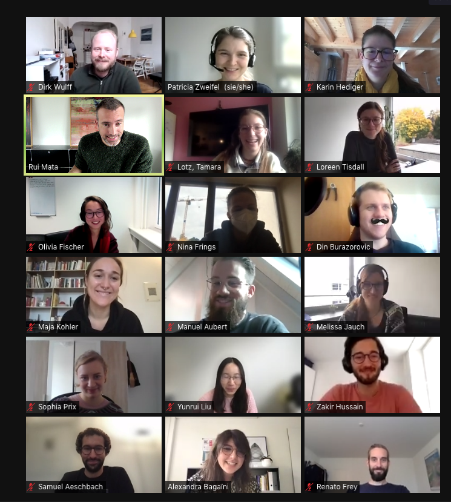

</img>
*Discussion of Hackathon results @ CDS Brownbag, Oct 26th 2021*

### Guests
Patricia Zweifel, Diversity Office

Karin Hediger, Prof Dr. and Diversity Representative, Faculty of Psychology

### Contributors (code, text, comments):
- Samuel Aeschbach
- Alexandra Bagaïni
- Nina Frings
- Fiona Gröflin
- Zakir Hussain
- Mariela Jaffé
- Yunrui Liu
- Tamara Lotz
- Svea Maeder
- Sophia Prix
- Loreen Tisdall

### Organizers:
- Rui Mata
- Dirk Wulff